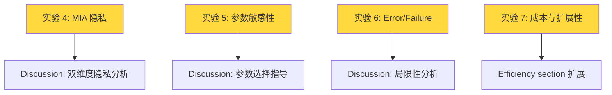

# P1 实验详细规格：高优先级实验

> **定位**：这四项实验是 TKDD 期刊论文深度和广度的关键提升项。完成后将大幅增强方法的可信度和鲁棒性论证，使论文从"强实验的会议论文"提升为"深度系统分析的期刊论文"。

---

## 实验 4：Membership Inference Attack (MIA) 隐私评估

### 4.1 实验目的

**核心目标**：使用标准的隐私评估方法（Membership Inference Attack）补充现有的 NN Privacy Risk 指标，建立双维度隐私评估体系。

**审稿人原文 (hziw W3)**：
> "The privacy metric based on nearest-neighbor matching is insufficiently justified and not compared with standard approaches (e.g., membership inference), limiting the credibility of the privacy claims."

**审稿人原文 (hziw Q4)**：
> "Can the authors better justify the chosen privacy metric and compare it with standard evaluations?"

### 4.2 合理性与必要性分析

| 维度 | 分析 |
|---|---|
| **NN Privacy Risk 的局限** | NN Privacy Risk 衡量的是 **record-level memorization**（合成样本是否"复制"了训练样本），但不衡量 **model-level information leakage**（是否可以判断某条记录是否在训练集中）。MIA 衡量的正是后者 |
| **社区标准** | MIA 是隐私保护领域最广泛使用的评估方法（Shokri et al., 2017; Ye et al., 2022）。不包含 MIA 的隐私评估在顶刊中容易被质疑 |
| **互补价值** | 两个指标衡量不同维度：NN Privacy Risk → 合成数据是否过度相似于训练数据；MIA → 攻击者能否利用合成数据推断训练集成员身份。两者互补而非替代 |
| **审稿人期望** | hziw **明确要求**与 MIA 比较。满足此要求可直接提升其 Technical Quality 评分 |

### 4.3 实验设置

#### MIA 攻击方法

| 攻击方法 | 复杂度 | 描述 | 推荐 |
|---|---|---|---|
| **Logistic Regression MIA** | 低 | 训练一个 LR 分类器区分"成员"和"非成员"样本 | ✅ 首选（简单、标准） |
| **Shadow Model Attack** | 中 | 训练多个 shadow 模型模拟目标模型，学习成员/非成员的行为差异 | ✅ 备选（更严格） |
| **Likelihood Ratio Attack** | 中 | 比较样本在"成员模型"和"参考模型"下的似然比 | 可选 |

#### 具体实现方案（Logistic Regression MIA）

**攻击场景定义**：
- **攻击者目标**：给定一条真实数据记录 $x$，判断 $x$ 是否在生成合成数据所用的训练集 $\mathcal{D}_\text{train}$ 中
- **攻击者知识**：攻击者拥有合成数据集 $\mathcal{D}_\text{synth}$ 和目标记录 $x$

**攻击步骤**：
1. 对每条训练集记录 $x \in \mathcal{D}_\text{train}$，计算其到 $\mathcal{D}_\text{synth}$ 中 $k$ 个最近邻的距离特征向量
2. 对每条测试集记录 $x \in \mathcal{D}_\text{test}$，同样计算距离特征向量
3. 标记：$\mathcal{D}_\text{train}$ 样本为正类（member），$\mathcal{D}_\text{test}$ 样本为负类（non-member）
4. 训练 Logistic Regression 分类器并报告 **AUROC**

**距离特征设计**：
- 到最近 $k=5$ 个合成样本的距离（L1 + Hamming，与论文一致）
- 到最近邻的距离
- 到 $k$ 个最近邻的平均距离
- 距离的标准差

#### 评估指标

| 指标 | 含义 | 理想值 |
|---|---|---|
| **MIA AUROC** | 攻击者区分成员/非成员的能力 | **0.5**（随机猜测，即攻击完全失败） |
| **MIA Accuracy** | 攻击者的正确率 | **50%** |
| **MIA Advantage** | AUROC - 0.5 | **0**（无优势） |

#### 数据集范围

- 所有 6 个 real-world 数据集
- 如已新增数据集（实验 2），同步覆盖

#### 需评估的方法

重点对比以下方法（选择理由）：
- **StructSynth**（本方法）
- **CLLM**（最直接的 ablation 对比，相同 LLM 无结构引导）
- **GReaT**（NN Privacy Risk 最差的方法，MIA 表现可能也差）
- **GraDe**（中等 NN Privacy Risk，MIA 表现待验证）
- **CTGAN**（代表性 DGM）
- **NFlow**（NN Privacy Risk 表现较好的 DGM）
- **Bayesian Network**（传统结构方法）

### 4.4 结果呈现

- **新建 Table**：报告各方法的 MIA AUROC（逐数据集 + 平均 + 排名）
- **新建 Figure**：绘制 NN Privacy Risk vs. MIA AUROC 的散点图
  - 预期：两个指标应呈现正相关（高 NN Risk → 高 MIA AUROC）
  - StructSynth 应位于左下角（双低 = 双安全）
- **Discussion 中分析**：两个指标的异同，何时一个更 informative

### 4.5 预期结果与风险

| 预期 | 概率 | 应对 |
|---|---|---|
| StructSynth MIA AUROC ≈ 0.5（攻击失败） | 高（基于 NN ≈ 50%） | 完美支持隐私声明 |
| GReaT MIA AUROC 显著 > 0.5 | 高（基于 NN ≈ 90%） | 佐证"高 fidelity = memorization"的论点 |
| 两个指标不一致（如某方法 NN 好但 MIA 差） | 低-中 | 有趣的发现，可在 Discussion 中深入探讨 |

---

## 实验 5：参数敏感性分析 (Parameter Sensitivity)

### 5.1 实验目的

**核心目标**：系统评估关键超参数对 StructSynth 性能的影响，展示方法的鲁棒性和实际可操作性。

**审稿人触发**：
- hziw Q2："What specific mechanisms make the approach particularly suitable for low-data regimes?"（需展示 few-shot 数量 $k$ 的影响）
- TKDD 期刊标准：参数敏感性分析是期刊实验的标准组成部分

**现有 checklist 中已列出**：`tkdd_improvement_checklist.md` 中优先级已标注。

### 5.2 合理性与必要性分析

| 维度 | 分析 |
|---|---|
| **TKDD 期刊标准** | ✅ 期刊论文几乎必须包含参数敏感性分析。缺失将被视为实验不完整 |
| **实际部署指导** | 参数敏感性分析帮助读者了解如何在自己的数据上配置 StructSynth |
| **与低数据动机的联系** | few-shot $k$ 的敏感性直接验证"method 在不同数据量下的行为"，强化低数据场景的核心动机 |
| **方法鲁棒性论证** | 如果性能对参数变化不敏感，说明方法鲁棒；如果敏感，指导用户如何选择最优参数 |

### 5.3 实验设置

#### 实验 5a：Few-shot 样本数 $k$ 的影响

| 参数 | 设置 |
|---|---|
| **变量** | $k = 10, 20, 50, 100, 200, 500$ |
| **固定参数** | temperature=0.9, LLM=gpt-4o-mini, $s$=1000 |
| **数据集** | Adult, Anxiety, Compas（3 个代表性数据集，覆盖分类和 post-cutoff） |
| **评估指标** | AUC, Statistical Fidelity, Privacy Risk |
| **重复次数** | 5 次（减少成本，但保证稳定性） |
| **对比方法** | StructSynth vs. CLLM（最直接的消融对比） |

**分析重点**：
- 绘制 AUC vs. $k$ 曲线
- 观察 StructSynth 和 CLLM 的优势差距如何随 $k$ 变化
- 预期：$k$ 很小时（10-20），StructSynth 的结构引导优势最显著
- 与现有 Figure 4（varying-n，n=20-200）互补但不同：Figure 4 固定 $k=5$，此实验固定 $n=100$ 变化 $k$

> [!NOTE]
> 此处需注意 $k$ 和 $n$ 的区别。论文中 $n$ 是训练集大小，$k$ 是 few-shot 示例数量（用于 prompt）。两者可能在某些实现中是相同概念，需确认。

#### 实验 5b：LLM Temperature 的影响

| 参数 | 设置 |
|---|---|
| **变量** | $T = 0.3, 0.5, 0.7, 0.9, 1.0, 1.2$ |
| **固定参数** | $n$=100, $k$=论文默认, LLM=gpt-4o-mini, $s$=1000 |
| **数据集** | Adult, Anxiety（2 个数据集，节省 API 成本） |
| **评估指标** | AUC, Statistical Fidelity, Privacy Risk |
| **重复次数** | 5 次 |

**分析重点**：
- Temperature 对生成多样性 vs. 保真度的 trade-off
- 低 temperature (0.3) → 更确定性的输出 → 可能更高的 fidelity 但更低的多样性（可能增加 memorization）
- 高 temperature (1.2) → 更多样 → 可能更好的隐私但更低的 fidelity
- 是否存在 sweet spot（当前 0.9 是否最优？）

#### 实验 5c：关联分数阈值的影响

| 参数 | 设置 |
|---|---|
| **变量** | 阈值 $\theta \in \{0.0, 0.1, 0.2, 0.3, 0.5\}$（低于阈值的关联分数不纳入 prompt） |
| **固定参数** | $n$=100, temperature=0.9 |
| **数据集** | Adult（1 个数据集，因为需分析图结构变化） |
| **评估指标** | AUC, SHD（如有 reference graph）, 图边数, LLM 调用数 |
| **重复次数** | 3 次 |

**分析重点**：
- 阈值对发现的 DAG 密度的影响（边数 vs. 阈值）
- 阈值过低 → 噪声信号进入 → 可能产生虚假边
- 阈值过高 → 过滤有效信号 → 可能遗漏真实依赖
- 成本影响：高阈值 → 更少的 prompt 内容 → 更少的 token

### 5.4 结果呈现

- **新建 Figure**：三个子图（$k$, $T$, $\theta$），每个子图展示参数变化对 AUC（主轴）和 Fidelity/Privacy（次轴）的影响
- 可选：附带参数选择建议（类似 hyperparameter tuning guideline）

---

## 实验 6：Error / Failure Case 分析

### 6.1 实验目的

**核心目标**：系统识别和分析 StructSynth 表现不佳的场景，量化结构错误的传播效应，并展示方法的 graceful degradation 特性。

**审稿人原文 (f5xi W3)**：
> "The method explicitly introduces dependency discovery and statistical signals to improve structural consistency, so one would expect stronger statistical fidelity... However, the reported results do not clearly support this expectation."

**审稿人原文 (f5xi W4)**：
> "Errors in the discovered dependency structure may propagate to the generation stage."

**审稿人原文 (hziw Q3)**：
> "How robust is the LLM-guided structure discovery under small samples, and how do errors in the learned DAG affect downstream generation quality?"

### 6.2 合理性与必要性分析

| 维度 | 分析 |
|---|---|
| **回应 f5xi W3** | ✅ 这是 f5xi 最尖锐的批评。StructSynth 的 Statistical Fidelity 排名 7.08（全局 pairwise），但如果在 **DAG 编码的依赖关系** 上更优，就能化解这一批评。需要新指标来证明 |
| **回应 f5xi W4 + hziw Q3** | ✅ 当前仅有 ablation 证据（替换发现算法 →-1.0/-1.4 AUC）。需要更系统的错误传播量化 |
| **TKDD 深度要求** | 期刊论文需要对方法的局限性有深入理解和坦诚讨论。Failure case 分析展示了学术诚意和方法论成熟度 |

### 6.3 实验设置

#### 实验 6a：Conditional Dependency Fidelity 分析

**定义新指标**：
$$\text{CondDepFidelity} = \frac{1}{|E|} \sum_{(i,j) \in E} \Delta(C_i, C_j)$$

其中 $E$ 是 DAG 中的所有有向边集合（父-子对），$\Delta$ 是与论文中 Statistical Fidelity 相同的 pairwise 统计量。

**对比**：
- **Global Statistical Fidelity**：所有 $\binom{K}{2}$ 对的平均（当前指标）
- **Conditional Dependency Fidelity**：仅 DAG 编码的父-子对的平均（新指标）
- **Non-edge Fidelity**：DAG 中未连接的对的平均（作为对照）

**预期结果**：
- StructSynth 在 Conditional Dep Fidelity 上应 **显著优于** baseline（因为生成过程按构造遵守这些依赖）
- GReaT 在 Global Fidelity 更好但可能在 Conditional Dep Fidelity 上不占优（memorization 与真正的结构理解的区别）

**数据集**：Adult（有 reference graph）+ 3 个 bnlearn benchmark（有 ground-truth DAG）

#### 实验 6b：错误传播量化 (Error Injection)

**方法**：在 StructSynth 发现的 DAG 上人为注入 $k$ 条错误，观察下游性能退化。

**错误类型**：
1. **Edge Addition**：添加 $k$ 条虚假边（随机选择不相连的节点对）
2. **Edge Deletion**：删除 $k$ 条真实边（随机选择现有边）
3. **Edge Reversal**：反转 $k$ 条边的方向

**实验参数**：
- $k = 1, 2, 3, 5, \text{all}$
- 数据集：Adult（15 features, reference graph 可用）
- 重复 5 次（不同随机错误注入）

**输出**：
- 绘制 **SHD vs. AUC** 散点图
- 绘制 **错误数量 $k$ vs. AUC 退化** 曲线
- 量化 graceful degradation rate（每条错误边对应多少 AUC 退化？）

#### 实验 6c：失败场景识别与分析

**方法**：在所有数据集上，识别 StructSynth 与最佳 baseline 差距最小或落后的子维度。

**分析维度**：
1. **按特征类型**：纯数值 vs. 纯分类 vs. 混合 → 是否有某种类型的数据不适合？
2. **按依赖密度**：稀疏图 vs. 密集图 → 密集依赖是否更难捕捉？
3. **按特征数量**：少特征（8, Compas）vs. 多特征（19, Anxiety）→ 可扩展性边界在哪？
4. **按数据子集**：train 中的某些子群（如 Adult 中的高收入 vs. 低收入组）→ 合成数据是否在某些子群上更准确？

### 6.4 结果呈现

- **实验 6a**：新建 Table（Global vs. Conditional vs. Non-edge Fidelity 对比）
- **实验 6b**：新建 Figure（Error injection curves）
- **实验 6c**：在 Discussion section 中详细讨论，配合定性示例

### 6.5 预期结果与风险

| 预期 | 概率 | 应对 |
|---|---|---|
| Conditional Dep Fidelity 上 StructSynth 显著领先 | 高 | 完美化解 f5xi W3 |
| 错误传播呈 graceful degradation | 高（基于 ablation 趋势） | 增强 robustness 论证 |
| 发现特定失败模式 | 中 | 在 Limitations 和 Discussion 中坦诚讨论 |

---

## 实验 7：计算成本与可扩展性系统分析

### 7.1 实验目的

**核心目标**：将现有的 token usage 分析（Appendix 级别）扩展为系统级的计算成本和可扩展性分析，包括 runtime、货币成本和特征维度可扩展性。

**审稿人原文 (f5xi W5)**：
> "The approach appears to require repeated LLM calls during structured generation, which could introduce substantial computational overhead. The paper would be stronger if it discussed inference cost, runtime, and scalability more explicitly."

**审稿人原文 (hziw Q5)**：
> "Can the authors provide a clearer analysis of computational cost (e.g., token usage, runtime) versus performance gains, especially for practical deployment?"

**审稿人原文 (ep8Q Q2)**：
> "What happens when the number of features increases significantly (e.g., 50+ columns)?"

### 7.2 合理性与必要性分析

| 维度 | 分析 |
|---|---|
| **三位审稿人共同关注** | ✅ f5xi, hziw, ep8Q 均提出了成本/扩展性问题，是审稿人共识度最高的 P1 实验 |
| **当前不足** | 论文在正文中仅用 3 行描述成本，详细分析在 Appendix。对于期刊版本，应在正文中提供更系统的分析 |
| **实际部署相关性** | 成本分析直接影响方法的实际可用性判断。TKDD 关注方法的实际价值 |

### 7.3 实验设置

#### 实验 7a：Runtime 对比（Wall-Clock Time）

| 设置 | 详情 |
|---|---|
| **对比方法** | 所有 12 个方法（但 DGMs 可不含训练时间，仅含生成时间，for fairness） |
| **数据集** | Adult, Anxiety, Compas（3 个代表性数据集） |
| **时间分解** | StructSynth: `structure discovery time + generation time`；其他方法: `training/setup time + generation time` |
| **硬件/环境** | 记录 API 调用延迟环境（注明网络条件对 API call latency 的影响） |

**输出**：Bar chart 展示各方法的 runtime，StructSynth 按阶段分色

#### 实验 7b：特征维度可扩展性

| 设置 | 详情 |
|---|---|
| **特征数据点** | $K = 8$ (Compas), $12$ (Churn), $15$ (Adult/Obesity), $18$ (Salary), $19$ (Anxiety), $27$ (Insurance benchmark) |
| **如果可能** | 增加 $K = 40+$ 的数据集（选自实验 2 的候选，如 Diabetes 130 有 50+ features） |
| **测量指标** | LLM 查询次数, Token 消耗, Runtime, Graph stage vs. Table stage 占比 |

**输出**：
- 绘制 **特征数 $K$ vs. Token 消耗** 的散点图（带拟合线）
- 绘制 **特征数 $K$ vs. Runtime** 的散点图
- 分析增长率：O($K$) vs. O($K^2$) vs. 其他

#### 实验 7c：成本-性能 Pareto 图

| 设置 | 详情 |
|---|---|
| **X 轴** | Total token 消耗（或估算货币成本） |
| **Y 轴** | Downstream AUC（平均） |
| **数据点** | 12 个方法在所有数据集上的平均 |

**分析**：
- 识别 Pareto 前沿
- 计算 StructSynth 的 **成本效益比**（每增加单位 token 消耗带来的 AUC 增量 vs. CLLM）
- 与 DGMs 的训练成本对比（GPU time vs. API cost）

### 7.4 结果呈现

- **实验 7a**：新建 Table or Bar chart（runtime 对比）
- **实验 7b**：新建 Figure（可扩展性曲线）
- **实验 7c**：新建 Figure（Pareto 图）
- 正文中的 Efficiency Analysis section 扩展为完整的子节

### 7.5 预期结果与风险

| 预期 | 概率 | 应对 |
|---|---|---|
| StructSynth 的 overhead 约 +31% token 且 runtime 增加可控 | 高（已有数据） | 强化"modest overhead"的论点 |
| 可扩展性呈近线性增长（O(K)） | 中高（BFS 设计保证） | 强有力的可扩展性论证 |
| 50+ features 数据集成功运行 | 中（未测试过） | 展示高维可行性 |
| 50+ features 性能退化或成本过高 | 低-中 | 在 Limitations 中讨论，提出分治策略（模块化发现） |

---

## P1 实验间的依赖关系与执行顺序

**四个实验之间无硬依赖，可完全并行推进。**

**建议执行优先级**：

| 顺序 | 实验 | 理由 |
|---|---|---|
| 1 | 实验 4 (MIA) | 投资回报率最高：工作量中等，直接满足 hziw 明确要求 |
| 2 | 实验 7 (成本) | 三位审稿人共同关注；且部分数据已有（Appendix token 分析），工作量最小 |
| 3 | 实验 6 (Error/Failure) | 回应 f5xi 最尖锐批评（统计保真度），且 Conditional Dep Fidelity 可成为新贡献 |
| 4 | 实验 5 (参数敏感性) | TKDD 标准要求，但对审稿人评分提升的直接影响最小 |

> [!TIP]
> 如果时间紧张，实验 4 和实验 7 是 P1 中**必须完成**的；实验 5 和实验 6 可以部分完成（如仅做 5a 和 6a）。
